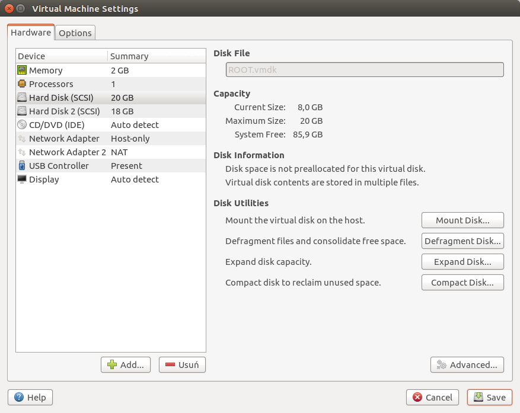
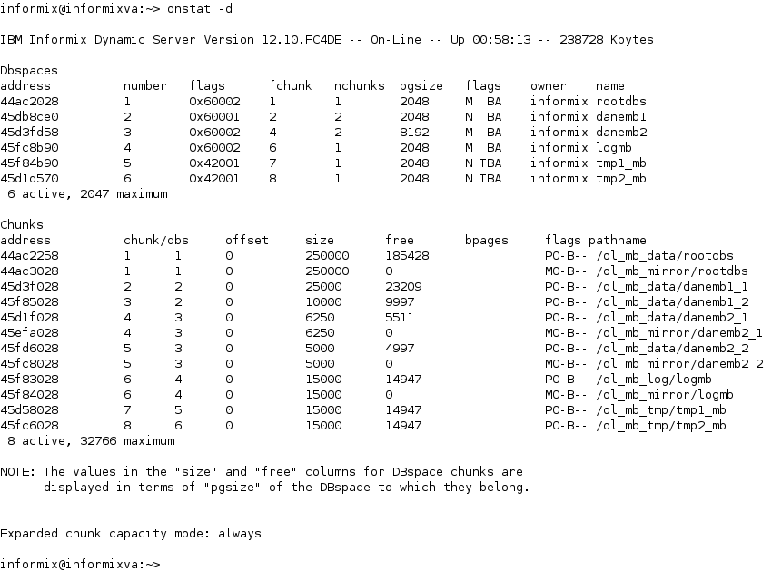

# Informix

Sprawozdanie z zadania kończącego cykl zajęć związanych z serwerem Informix.

## Przygotowanie maszyny wirtualnej

By zapewnić poprawne działanie serwera w maszynie wirtualnej, zwiększono wielkość wirtualnego dysku, jak również ilość dostępnej pamięci.



<br />

## Tworzenie instancji

### Ustawienie zmiennych środowiskowych

Do pliku `~/.bashrc` zostały dodane następujące komendy:

```bash
export INFORMIXDIR=/opt/IBM/informix
export PATH=$INFORMIXDIR/bin:$PATH
export ONCONFIG=onconfig.ol2016_mb
export INFORMIXSERVER=ol2016_mb
export INFORMIXSQLHOSTS=/home/informix/sqlhosts
```

Ustawiają one zmienne środowiskowe używane przez narzędzia Informix.

### Dodanie hosta w pliku `sqlhosts`

Definicja połączenia sieciowego (TCP) na porcie 9092:

```bash
# /home/informix/sqlhosts
ol2016_mb    onsoctcp     *localhost 9092
```

Zmiana uprawnień:

```bash
 $ chmod 660 $INFORMIXSQLHOSTS
```

### Utworzenie katalogów z danymi

```bash
 $ su
 # mkdir /ol_mb_data
 # mkdir /ol_mb_mirror
 # chown informix:informix /ol_mb_*
 # chmod 770 /ol_mb_*
 # exit
```

### Tworzenie pliku `rootdbs` i mirror

```bash
 $ cat /dev/null > /ol_mb_data/rootdbs
 $ chmod 660 /ol_mb_data/rootdbs
 $ cat /dev/null > /ol_mb_mirror/rootdbs
 $ chmod 660 /ol_mb_mirror/rootdbs
```

### Konfiguracja serwera

Stworzenie pliku konfiguracyjnego:

```bash
 $ cd $INFORMIXDIR/etc
 $ cp onconfig.std $ONCONFIG
```

Zmiany w pliku konfiguracyjnym względem standardowej konfiguracji:

```
ROOTPATH /ol_mb_data/rootdbs
ROOTSIZE 500000
MIRROR 1
MIRRORPATH /ol_mb_mirror/rootdbs

SERVERNUM 133
DBSERVERNAME ol2016_mb
```

Wielkość pliku `rootdbs` została zwiększona z 200MB do 500MB, by możliwe było poprawne wykonanie kolejnych zadań.

### Uruchomienie instancji

```bash
 $ oninit -ivy
Reading configuration file '/opt/IBM/informix/etc/onconfig'\
  '.ol2016_mb'...succeeded
Creating /INFORMIXTMP/.infxdirs...succeeded
Allocating and attaching to shared memory...succeeded
Creating resident pool 4310 kbytes...succeeded
Creating infos file "/opt/IBM/informix/etc/'\
  '.infos.ol2016_mb"...succeeded
Linking conf file "/opt/IBM/informix/etc/'\
  '.conf.ol2016_mb"...succeeded
Initializing rhead structure...rhlock_t 16384 (512K)... \
  rlock_t (2656K)... Writing to infos file...succeeded
Initialization of Encryption...succeeded
Initializing ASF...succeeded
Initializing Dictionary Cache and SPL Routine Cache...\
  succeeded
Bringing up ADM VP...succeeded
Creating VP classes...succeeded
Forking main_loop thread...succeeded
Initializing DR structures...succeeded
Forking 1 'soctcp' listener threads...succeeded
Forking 1 'soctcp' listener threads...succeeded
Starting tracing...succeeded
Initializing 8 flushers...succeeded
Initializing log/checkpoint information...succeeded
Initializing dbspaces...succeeded
Opening primary chunks...succeeded
Validating chunks...succeeded
Creating database partition...succeeded
Initialize Async Log Flusher...succeeded
Starting B-tree Scanner...succeeded
Init ReadAhead Daemon...succeeded
Init DB Util Daemon...succeeded
Initializing DBSPACETEMP list...succeeded
Init Auto Tuning Daemon...succeeded
Checking database partition index...succeeded
Initializing dataskip structure...succeeded
Checking for temporary tables to drop...succeeded
Updating Global Row Counter...succeeded
Forking onmode_mon thread...succeeded
Creating periodic thread...succeeded
Creating periodic thread...succeeded
Starting scheduling system...succeeded
Verbose output complete: mode = 5
 $ onstat -m
IBM Informix Dynamic Server Version 12.10.FC4DE -- \
  On-Line -- Up 00:00:55 -- 164460 Kbytes
```

## Konfiguracja połączeń

### Zdefiniowanie dodatkowego portu dla serwera

Zmiana w pliku `$INFORMIXSQLHOSTS` - zdefiniowanie nowego hosta:

```bash
ol2016_mb         onsoctcp     *localhost 9092
ol2016_tcp2_mb    onsoctcp     *localhost 9094
```

Zmiana w pliku `$INFORMIXDIR/etc/$ONCONFIG` - dodanie aliasu bazy danych:

```bash
DBSERVERALIASES ol2016_tcp2_mb
```

### Restart instancji

```bash
 $ onmode -ky
 $ oninit
```

### Weryfikacja poprawności konfiguracji

```bash
 $ INFORMIXSERVER=ol2016_mb onstat -m
IBM Informix Dynamic Server Version 12.10.FC4DE -- \
  On-Line -- Up 00:01:31 -- 148076 Kbytes
 $ INFORMIXSERVER=ol2016_tcp2_mb onstat -m
IBM Informix Dynamic Server Version 12.10.FC4DE -- \
  On-Line -- Up 00:01:57 -- 148076 Kbytes
```

Dla upewnienia się, że powyższy sposób rzeczywiście próbuje połączyć się przez zdefiniowane interfejsy:

```bash
 $ INFORMIXSERVER=ol2016_tcp2_xx onstat -m
shared memory not initialized for INFORMIXSERVER \
  'ol2016_tcp2_xx'
```

> Snapshot 'Konfiguracja połączeń' zawiera stan maszyny wirtualnej po wykonaniu powyższych poleceń

## Zarządzanie przestrzenią dyskową

### Przestrzeń 1

Utworzenie plików dla przestrzeni:

```bash
 $ cat /dev/null > /ol_mb_data/danemb1_1
 $ chmod 660 /ol_mb_data/danemb1_1
 $ cat /dev/null > /ol_mb_data/danemb1_2
 $ chmod 660 /ol_mb_data/danemb1_2
```

Stworzenie przestrzeni:

```bash
 $ onspaces -c -d danemb1 -p /ol_mb_data/danemb1_1 -o 0 \
     -s 50000
 $ onspaces -a danemb1 -p /ol_mb_data/danemb1_2 -o 0 \
     -s 20000
```

### Przestrzeń 2 z mirror

Utworzenie plików dla przestrzeni:

```bash
 $ cat /dev/null > /ol_mb_data/danemb2_1
 $ chmod 660 /ol_mb_data/danemb2_1
 $ cat /dev/null > /ol_mb_data/danemb2_2
 $ chmod 660 /ol_mb_data/danemb2_2
 $ cat /dev/null > /ol_mb_mirror/danemb2_1
 $ chmod 660 /ol_mb_mirror/danemb2_1
 $ cat /dev/null > /ol_mb_mirror/danemb2_2
 $ chmod 660 /ol_mb_mirror/danemb2_2
```

Stworzenie przestrzeni:

```bash
 $ onspaces -c -d danemb2 -p /ol_mb_data/danemb2_1 -o 0 \
     -s 50000 -k 8 -m /ol_mb_mirror/danemb2_1 0
 $ onspaces -a danemb2 -p /ol_mb_data/danemb2_2 -o 0 \
     -s 40000 -m /ol_mb_mirror/danemb2_2 0
```

### Przestrzeń 3 dla logów

Utworzenie plików dla przestrzeni:

```bash
 $ sudo mkdir /ol_mb_log
 $ sudo chown informix:informix /ol_mb_log
 $ cat /dev/null > /ol_mb_log/logmb
 $ chmod 660 /ol_mb_log/logmb
 $ cat /dev/null > /ol_mb_mirror/logmb
 $ chmod 660 /ol_mb_mirror/logmb
```

Stworzenie przestrzeni:

```bash
 $ onspaces -c -d logmb -p /ol_mb_log/logmb -o 0 \
     -s 30000 -m /ol_mb_mirror/logmb 0
```

### Przestrzenie 4 i 5 na dane tymczasowe

Utworzenie plików dla przestrzeni:

```bash
 $ sudo mkdir /ol_mb_tmp
 $ sudo chown informix:informix /ol_mb_tmp
 $ cat /dev/null > /ol_mb_tmp/tmp1_mb
 $ chmod 660 /ol_mb_tmp/tmp1_mb
 $ cat /dev/null > /ol_mb_tmp/tmp2_mb
 $ chmod 660 /ol_mb_tmp/tmp2_mb
```
Stworzenie przestrzeni:

```bash
 $ onspaces -c -d tmp1_mb -p /ol_mb_tmp/tmp1_mb \
     -o 0 -s 30000 -t
 $ onspaces -c -d tmp2_mb -p /ol_mb_tmp/tmp2_mb \
     -o 0 -s 30000 -t
```

### Utworzenie baz danych

Bazy danych `db1_mb` oraz `db2_mb` zostały utworzone za pomocą narzędzia `dbaccess`.

### Weryfikacja poprawności



Informacje o konkretnych przestrzeniach pochodzą z wyniku komendy `oncheck -pe`. Ze względu na duży rozmiar wyjścia tej komendy, w sprawozdaniu została zamieszona skrócona informacja.

```bash
DBspace Usage Report: rootdbs
 Chunk Pathname
     1 /ol_mb_data/rootdbs

 Total Used:    64572
 Total Free:   185428

DBspace Usage Report: danemb1
 Chunk Pathname
     2 /ol_mb_data/danemb1_1

 Total Used:     1791
 Total Free:    23209

 Chunk Pathname
     3 /ol_mb_data/danemb1_2

 Total Used:        3
 Total Free:     9997


DBspace Usage Report: danemb2
 Chunk Pathname
     4 /ol_mb_data/danemb2_1

 Total Used:      739
 Total Free:     5511

 Chunk Pathname
     5 /ol_mb_data/danemb2_2

 Total Used:        3
 Total Free:     4997

DBspace Usage Report: logmb
 Chunk Pathname
     6 /ol_mb_log/logmb

 Total Used:       53
 Total Free:    14947

DBspace Usage Report: tmp1_mb
 Chunk Pathname
     7 /ol_mb_tmp/tmp1_mb

 Total Used:       53
 Total Free:    14947

DBspace Usage Report: tmp2_mb
 Chunk Pathname
     8 /ol_mb_tmp/tmp2_mb

 Total Used:       53
 Total Free:    14947
```
